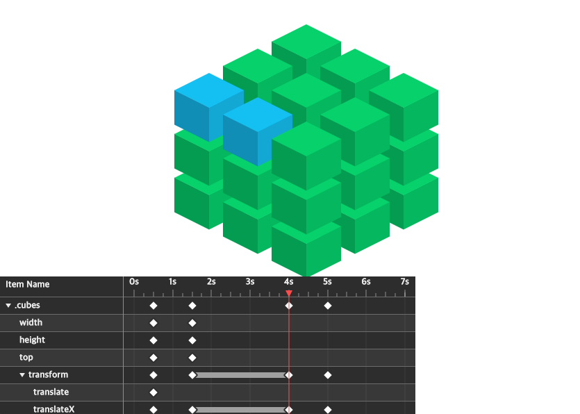

# @scenejs/timeline



```sh
$ npm i @scenejs/timeline
```
```html
<script src="https://daybrush.com/scenejs-timeline/release/latest/dist/timeline.pkgd.min.js"></script>
```
```js
import Scene from "scenejs";
import Timeline from "@scenejs/timeline";

const scene = new Scene({
    ...
});

new Timeline(scene, document.body);
```